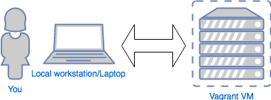

### Running Ansible


#### Running Ansible

* There are two ways to run ansible:<!-- .element: class="fragment" data-fragment-index="0" -->
  * ad hoc <!-- .element: class="fragment" data-fragment-index="1" -->
    * Run a single task <!-- .element: class="fragment" data-fragment-index="2" -->
    * <!-- .element: class="fragment" data-fragment-index="3" --><code>ansible &lt;pattern&gt; [options]</code>
  * Playbook <!-- .element: class="fragment" data-fragment-index="4" -->
    * Run multiple tasks sequentially <!-- .element: class="fragment" data-fragment-index="5" -->
    * <!-- .element: class="fragment" data-fragment-index="6" --><code>ansible-playbook &lt;pattern&gt; [options]</code>


#### Ad hoc tasks with Ansible

  ansible <pattern> [options]

* Perform a few <!-- .element: class="fragment" data-fragment-index="0" -->_ad hoc_ operations with Ansible 
    * Check connection to server<!-- .element: class="fragment" data-fragment-index="1" -->
    * Install packages<!-- .element: class="fragment" data-fragment-index="2" -->
    * Run system commands <!-- .element: class="fragment" data-fragment-index="3" -->


#### Before we start

In all the following examples, `$WORKDIR` is the path to the `introduction-to-ansible/sample-code` directory.

    $ echo $WORKDIR
    /home/train/introduction-to-ansible/sample-code


#### Simulating a remote server

 <!-- .element:  style="height:50%;" -->

* <!-- .element: class="fragment" data-fragment-index="0" -->For demo purposes in this course we will be using [Vagrant](https://www.vagrantup.com/intro/index.html) to simulate remote hosts.
* <!-- .element: class="fragment" data-fragment-index="1" -->Instance(s) use a centos 7 image
<pre class="fragment" data-fragment-index="2"><code data-trim>
    $ cd $WORKDIR/adhoc
    $ vagrant up --provider virtualbox
    .
    
    ==&gt; default: Machine booted and ready!
</code></pre>

If all went well you now have a remote host to manage! <!-- .element: class="fragment" data-fragment-index="3" -->


#### Behind the scenes
  * Create SSH connection to a host or list of hosts (group) in parallel
  * Copy a small blob of executable code to each remote machine
  * Performs task: execute the code; capturing return code and output
  * Removes the blob of code
  * Closes the SSH connection
  * Report back on outcome of task


#### Connecting Ansible to a Host
* Ansible works by creating an SSH connection with remote hosts <!-- .element: class="fragment" data-fragment-index="0" -->
* Need a way to tell Ansible how to connect to our Vagrant VM via SSH <!-- .element: class="fragment" data-fragment-index="1" -->
                                


#### The Inventory File

<div style="width:50%;float:left;"><ul >

        <li class="fragment" data-fragment-index="0">
            A text file in <code>.ini</code> syntax
        </li>
        <li class="fragment" data-fragment-index="1">Identifies hosts for ansible to interact with
            <ul>
                <li>
                    Each host on a separate line
                </li>
            </ul>
        </li>

        <li class="fragment"
            data-fragment-index="2">Provides optional arguments after host
            <ul>
                <li>connection information</li>
                <li>
                    other arbitrary variables for
                    specific host
                </li>
            </ul>
        </li>

    </ul></div>

<div class="fragment" data-fragment-index="1" style="float:left;width:50%;"><pre><code data-trim>
    #sample inventory

    web1.mycompany.com
    web2.mycompany.com
    app1.mycompany.com

    db.mycompany.com
    lb.mycompany.com

    [auckland]
    web1.mycompany.com
    
    [wellington]
    web2.mycompany.com
</code></pre></div>


#### Sample Inventory File                            

```
[web]
web1.mycompany.com ansible_host=152.240.43.12 opt2=arg2
web2.mycompany.com

[db]
db1.mycompany.com

[app]
app1.mycompany.com
app2.mycompany.com

[lb]
loadbalancer.mycompany.com
```


#### Grouping Hosts
<div style="width:50%;float:left;"><ul>

        <li class="fragment" data-fragment-index="0">
            `[sections]` used to organise hosts into
            <em>groups</em>
            <ul>
                <li>functional roles</li>
                <li>separate regions</li>
            </ul>
        </li>
        <li class="fragment" data-fragment-index="1">
            Either group or specific hosts can be used in
            ansible commands
        </li>
      

    </ul></div>
    <div class="fragment" data-fragment-index="0" style="width:50%;float:left">
        <pre style="font-size:13pt;"><code data-trim>
            # sample inventory
            [web]
            web1.mycompany.com
            web2.mycompany.com

            [app]
            app1.mycompany.com
            app2.mycompany.com

            [wellington]
            web1.mycompany.com
            app1.mycompany.com

            [auckland]
            web2.mycompany.com
            app2.mycompany.com

        </code></pre>
    </div>


#### Our first inventory file

```
cat $WORKDIR/adhoc/ansible/hosts
```

* <!-- .element: class="fragment" data-fragment-index="0" -->Our inventory file specifies single remote host: _myserver_
* To connect to our Vagrant VM we need to set some special connection variables <!-- .element: class="fragment" data-fragment-index="1" -->
    * `ansible_host`
    * `ansible_user`
    * `ansible_port`
    * `ansible_private_key_file`
* Variables specified on same line as host <!-- .element: class="fragment" data-fragment-index="2" -->


##### Exercise: Edit your inventory file to fill in missing connection information

```
$ vagrant ssh-config
Host default
    HostName ???
    User ???
    Port ???
    .
    IdentityFile ???
    .
    
```

Use the values from your host to fill in missing arguments in <code>ansible/hosts</code>


#### Running _ad hoc_ commands with Ansible

<code>ansible </code><code style="color:red;">&lt;host pattern&gt;</code><code> [OPTIONS]</code>

* _host pattern_ can be:
   * the name of a specific host in inventory
   * a <em>group</em> of hosts from the inventory

| Option   | Argument  | Description |
|---- | ----- | ---- |
|-m  | string | module name to execute; default to _command_ module |
| -a | string | arguments to module |
| -i | string | path to inventory file |
| -b |   | Privilege escalation |
| --become-method | string | which become method to use; default is _sudo_ |


##### Exercise: Ping remote host

<!-- .element: class="fragment" data-fragment-index="0" -->[ping](http://docs.ansible.com/ansible/latest/ping_module.html) is an Ansible module that just checks whether or not Ansible can create a SSH sessions with hosts.

<!-- .element: class="fragment" data-fragment-index="1" -->Use the _ping_  module to check if our host accepts SSH connections
<pre class="fragment" data-fragment-index="2"><code
                        data-trim>
$ ansible myserver -i ansible/hosts -m ping
myserver | SUCCESS => {
    "changed": false,
    "ping": "pong"
}</code></pre>


#### The `ansible.cfg` File

<pre class="fragment" data-fragment-index="0" style="font-size:13pt;"><code data-trim>
# sample ansible.cfg

[defaults]
inventory = hosts
remote_user = vagrant
private_key_file = .vagrant/machines/default/virtualbox/private_key
host_key_checking = False
</code></pre>

* A configuration file where you can provide some defaults for ansible<!-- .element: class="fragment" data-fragment-index="0" -->
* .ini syntax <!-- .element: class="fragment" data-fragment-index="1" -->
* Specify SSH connection, which inventory file to use <!-- .element: class="fragment" data-fragment-index="2" -->


#### Locating `ansible.cfg`

* 4 possible locations in order of priority
  * <!-- .element: class="fragment" data-fragment-index="0" -->File specified by ANSIBLE_CONFIG 
  * <!-- .element: class="fragment" data-fragment-index="1" -->Current directory (<code>ansible.cfg</code>) 
  * <!-- .element: class="fragment" data-fragment-index="2" -->Home directory (<code>~/.ansible.cfg</code>) 
  * <!-- .element: class="fragment" data-fragment-index="3" -->`/etc/ansible/ansible.cfg` 


##### Exercise: Set up `ansible.cfg` and modify inventory file

```
$WORKDIR/ansible.cfg.sample
```

<pre class="fragment" data-fragment-index="0"><code data-trim>

$ cd $WORKDIR/adhoc
$ cp ../ansible.cfg.sample ansible.cfg
$ cat $WORKDIR/adhoc/hosts
myserver ansible_host=127.0.0.1 ansible_port=2222
</code></pre>

You now no longer need to specify an inventory file <!-- .element: class="fragment" data-fragment-index="1" -->
<pre class="fragment" data-fragment-index="1"><code data-trim> $ ansible myserver -m ping</code></pre>


#### Ansible Modules

* Blob of python that performs a very specific action <!-- .element: class="fragment" data-fragment-index="0" -->
* Ship with Ansible <!-- .element: class="fragment" data-fragment-index="1" -->
* <!-- .element: class="fragment" data-fragment-index="2" -->More than 200 [Ansible modules](https://docs.ansible.com/ansible/latest/list_of_all_modules.html) 
* When you run Ansible:<!-- .element: class="fragment" data-fragment-index="3" -->
  * <!-- .element: class="fragment" data-fragment-index="4" -->`scp` to temporary directory on target host
  * Execute python on target host <!-- .element: class="fragment" data-fragment-index="5" -->
  * Returns JSON <!-- .element: class="fragment" data-fragment-index="6" -->
  * Code removed from target host <!-- .element: class="fragment" data-fragment-index="7" -->
  * Local Ansible evaluates returned JSON <!-- .element: class="fragment" data-fragment-index="8" -->
  * Output <!-- .element: class="fragment" data-fragment-index="9" -->for task based on returned values


#### Ansible Output
* The output for each task tells you the net effect of task execution
   + `ok` <!-- .element: style="color:green;"  -->: no change was made
   + `changed` <!-- .element: style="color:orange;"  -->: A change was made to
     target
   + `failed` <!-- .element: style="color:red;"  -->: Ansible was unable to
     change target
* Exact interpretation will depend on task and module implementation


#### The _command_ module

<code style="font-size:15pt;">ansible &lt;host pattern&gt; -m command -a &lt;args to command&gt;</code>

* Execute arbitrary command on remote system <!-- .element: class="fragment" data-fragment-index="0" -->
* The default module <!-- .element: class="fragment" data-fragment-index="1" -->
* These are equivalent:<!-- .element: class="fragment" data-fragment-index="2" -->
  * <!-- .element: class="fragment" data-fragment-index="3" -->`ansible myserver -m command -a uptime`
  * <!-- .element: class="fragment" data-fragment-index="4" -->`ansible myserver -a uptime`
* <!-- .element: class="fragment" data-fragment-index="5" -->[Documentation](https://docs.ansible.com/ansible/latest/command_module.html)


##### Exercise: Get tail of system messages on your vagrant host

* Use the _command_ modules to tail the system log file
* This will be `/var/log/messages` on centos; `/var/log/syslog` on Debian/Ubuntu

<pre class="fragment" data-fragment-index="0"><code data-trim>
    $ ansible myserver  -b -a "tail /var/log/messages"
</code></pre>


##### Exercise: install a package

* Use the [yum](https://docs.ansible.com/ansible/latest/yum_module.html) module to install _mtr_ (network monitoring tool)

<pre class="fragment" data-fragment-index="0"><code data-trim>
    $ ansible myserver -b -m yum -a "name=mtr state=present"
</code></pre>
<asciinema-player class="fragment" data-fragment-index="1"  autoplay="0"  loop="loop" font-size="medium" speed="1"
     theme="solarized-light" src="lib/ansible-install-mtr.json" cols="200" rows="17"></asciinema-player>


#### Module documentation

Places you can find module documentation <!-- .element: class="fragment" data-fragment-index="0" -->
* <!-- .element: class="fragment" data-fragment-index="1" -->[The Ansible community docs](https://docs.ansible.com/ansible/latest/list_of_all_modules.html)
* <!-- .element: class="fragment" data-fragment-index="2" -->Inline documentation

<pre class="fragment" data-fragment-index="2"><code data-trim>
    $ ansible-doc yum

    &gt; YUM    (~/venv/local/lib/python2.7/site-packages/ansible/modules/packaging/os/yum.py)

            Installs, upgrade, downgrades, removes, and lists packages and groups with the `yum' package manager.

    OPTIONS (= is mandatory):

    - allow_downgrade
            Specify if the named package and version is allowed to downgrade a maybe already installed higher version of that package. Note that setting
            allow_downgrade=True can make this module behave in a non-idempotent way. The task could end up with a set of packages that does not match the complete
            list of specified packages to install (because dependencies between the downgraded package and others can cause changes to the packages which were in
            the earlier transaction).
            (Choices: yes, no)[Default: no]
            version_added: 2.4
</code></pre>


#### Summary

* This section has given you a small taste of using Ansible in <em>ad hoc</em> mode
* Interacted with a remote server
  * Check if SSH works
  * Install OS packages
  * Start services
* Explore documetation with <code>ansible-doc</code>


#### Before we move on

```
vagrant halt
vagrant destroy
```
