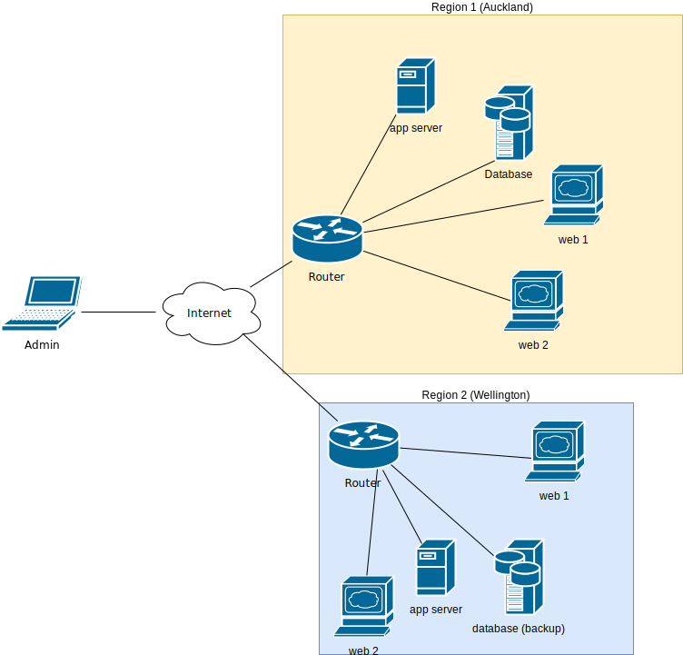

### Benefits of Automation

#### What does automation enable

 <!-- .element: class="fragment" data-fragment-index="0" style="float:left;width:30%;margin-right:5px;"-->
 <!-- .element: class="fragment" data-fragment-index="1" style="float:left;width:30%;margin-right:5px;"-->
 <!-- .element: class="fragment" data-fragment-index="2" style="float:left;width:30%;"-->

#### Typical application

 <!-- .element:  style="width:50%;float:left;"  -->

                        <ul style="font-size:18pt;"><li>
                                Applications have many components
                                <ul style="font-size:16pt;">
                                    <li class="fragment" data-fragment-index="0">Web servers</li>
                                    <li class="fragment" data-fragment-index="1">App servers</li>
                                    <li class="fragment" data-fragment-index="2">Load balancers</li>
                                    <li class="fragment" data-fragment-index="3">
                                        Network infrastructure: firewalls, subnets
                                        routers, etc.
                                    </li>
                                </ul>
                            </li>
                                    <li class="fragment"
                                        data-fragment-index="4">Components spread across multiple
                                        regions for redundancy</li>
                        </ul>
                    

### Disadvantages of manual deployment

* You could login to every machine in your network to: <!-- .element: class="fragment" data-fragment-index="0" -->
  * Install packages <!-- .element: class="fragment" data-fragment-index="1" -->
  * Update configuration <!-- .element: class="fragment" data-fragment-index="2" -->
  * Deploy code <!-- .element: class="fragment" data-fragment-index="3" -->
* Doing this manually can be: <!-- .element: class="fragment" data-fragment-index="4" -->
  * Time consuming <!-- .element: class="fragment" data-fragment-index="5" -->
  * Error prone <!-- .element: class="fragment" data-fragment-index="6" -->

### What is Automation?

* Automation is about taking manual processes and placing technology around them to make them repeatable.
* Automation is the key to speed, consistency, scalability and repeatability.

### Benefits of Automation

* Scalability
* Reliability
* Repeatability
* Consistency
* Auditability
* Security
