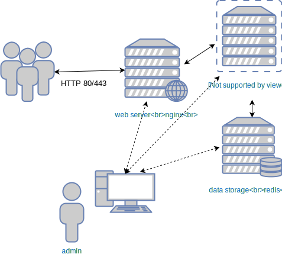

### Orchestrating Applications
#### Roles


#### Orchestration
* An application may need to interact with multiple services or other app
  components <!-- .element: class="fragment" data-fragment-index="0" -->
* Ansible provides tools to manage services when deploying or updating <!-- .element: class="fragment" data-fragment-index="1" -->
   + After code is deployed <!-- .element: class="fragment" data-fragment-index="2" -->
   + When a configuration is created or updated <!-- .element: class="fragment" data-fragment-index="3" -->
   + When another service is activated/deactivated <!-- .element: class="fragment" data-fragment-index="4" -->


#### Create a Cluster

```
cd $WORKDIR/sample-code/handlers
vagrant up
```
This sets up a cluster in vagrant consisting of 3 separate hosts <!-- .element: class="fragment" data-fragment-index="0" -->


#### Our Application Cluster <!-- .slide: class="image-slide" -->



#### Setup Machines
* Initially need to install Python so that Ansible can interact <!-- .element: class="fragment" data-fragment-index="0" -->
   + <!-- .element: class="fragment" data-fragment-index="1" -->`provision-hosts.yml`
* Next we set up each host for its assigned role <!-- .element: class="fragment" data-fragment-index="2" -->
   + deploy.yml<!-- .element: class="fragment" data-fragment-index="3" -->
      + web server running nginx <!-- .element: class="fragment" data-fragment-index="4" -->
      + app server running a basic Python Flask application <!-- .element: class="fragment" data-fragment-index="5" -->
      + a redis server <!-- .element: class="fragment" data-fragment-index="6" -->


#### Run Setup Playbook
```
ansible-playbook -K --ask-vault-pass \
   ansible/provision-hosts.yml ansible/deploy.yml
```

* You can now view your <!-- .element: class="fragment" data-fragment-index="0" -->[website](http://my-counter.testsite:8080)
* Also might wanto set up vault password file as in previous exercises <!-- .element: class="fragment" data-fragment-index="1" -->


#### Repeating Playbook Runs

* Run _just_ the `deploy.yml` playbook a few times
   ```
   ansible-playbook --ask-vault-pass ansible/deploy.yml
   ```
   <!-- .element: style="font-size:13pt;"  -->
* Note that many tasks display no change <!-- .element: class="fragment" data-fragment-index="0" -->(i.e. <code style="color:green;">ok</code>)
<asciinema-player class="fragment" data-fragment-index="1"  autoplay="0"  loop="loop" font-size="medium" speed="1"
     theme="solarized-light" src="lib/idempotent-tasks.json" start-at="15" cols="100" rows="10"></asciinema-player>
* A few are always <!-- .element: class="fragment" data-fragment-index="2" --><code style="color:orange;">changed</code>; notably _restart_ tasks


#### Repeating Playbook Runs
* Idempotent behaviour does not apply to certain types of tasks, for example:
  + cache updates <!-- .element: class="fragment" data-fragment-index="0" -->
  + restart services <!-- .element: class="fragment" data-fragment-index="1" -->
* These tasks always display <!-- .element: class="fragment" data-fragment-index="2" --><code style="color:orange;">changed</code>


####  Performing One-off tasks
* Often necessary to trigger certain actions on service when a config is created or changed
   + start
   + restart
   + reload
* Preferable to (re)start services only when necessary
   + config changed
   + application updated


### Handlers
* <!-- .element: class="fragment" data-fragment-index="0" -->A _handler_ is a task that Ansible will execute only once at the end of a play
* Handlers are triggered using the <!-- .element: class="fragment" data-fragment-index="1" -->_notify_ keyword
    <pre style="font-size:13pt;"><code data-trim data-noescape>
   tasks:
     - name: Change some config
       template:
         dest: /etc/some/config
         .
       <mark>notify: restart service</mark>
   <div class="fragment" data-fragment-index="2">
   handlers:
     - name: <mark>restart service</mark>
       systemd:
          name: service
          state: restartd
   </div>
   </code></pre>
* Will only execute if task result is <!-- .element: class="fragment" data-fragment-index="3" --><code style="color:orange;">changed</code>
* Execute only once <!-- .element: class="fragment" data-fragment-index="4" -->


#### Using Handlers
* `basic-handler.yml` simulates running basic tasks on our servers
   ```
   ansible-playbook --ask-vault-pass ansible/basic-handler.yml
   ```
* Debug tasks do not result in any changes
* Each play has a task to restart specific services
* Let's modify this to run these as _handlers_


#### Create First Handler
* Create a section called _handler_ and move the _restart nginx_ task into it
   ```
     handlers:
       - name: restart nginx
         systemd:
            name: nginx
            state: restarted
   ```


#### Notifying Handlers

* Set tasks to notify handler when changed
   <pre style="font-size=13pt;"><code data-trim data-noescape>
    - name: Set up nginx task 1
      <mark>notify: restart nginx</mark>
      .
      .
    - name: Set up nginx task 2
      <mark>notify: restart nginx</mark>
      .
      .
    - name: Set up nginx task 3
      <mark>notify: restart nginx</mark>
      .
   </code></pre>
* Re run the playbook
* This time the _restart nginx_ task does not run


#### Triggering a Handler
* Tasks in <!-- .element: class="fragment" data-fragment-index="0" -->`basic-handler.yml` have a special attribute to make Ansible think
  a change has occurred
  <pre><code data-trim data-noescape>
  - name: Set up nginx task 1
    .
    <mark>changed_when: nginx_config_changed | default(false)</mark>
  </code></pre>
* We can pass extra variables to interpret task as changed <!-- .element: class="fragment" data-fragment-index="1" -->
   ```
   ansible-playbook --ask-vault-pass ansible/basic-handler.yml\
        -e nginx_config_changed=true
   ```


#### Triggering Handlers
* _notify_ trigger for a handler can be called multiple times in a play
* Regardless, handler will only be fired off once per play
* Try the preceding exercise again with multiple extra vars
* Handler should only run once


#### Back to our Application
* Let's modify the `deploy.yml` playbook to use handlers


#### The Nginx Play
<pre style="font-size:13pt;"><code data-trim data-noescape>
  tasks:
    - name: Install nginx
      .
      .
    - name: Add nginx config
      .
      <mark>notify: restart nginx</mark>

    - name: Symlink nginx conf to activate
      .
      <mark>notify: restart nginx</mark>

  handlers
    - name: restart nginx
      service:
        name: nginx
        state: restarted
</code></pre>


#### The Redis Play
<pre style="font-size:13pt;"><code data-trim data-noescape>
  tasks:
    - name: Install redis
      .
      .
    - name: Enable redis on boot
      .
    - name: Set bind address to allow requests from other machines
      .
      <mark>notify: start redis</mark>
    - name: Modify redis config to work as a cache
      .
      <mark>notify: start redis</mark>

  handlers:
    - name: start redis
      systemd:
        name: redis-server
        state: restarted
</code></pre>


#### Application Setup Play
<pre style="font-size:11pt;"><code data-trim data-noescape>
  tasks:
      .
    - name: Checkout application from git
      .
      <mark>notify: restart gunicorn</mark>
    - name: Install python libraries
      .
      <mark>notify: restart gunicorn</mark>

    - name: Template in configuration
      .
      <mark>notify: reload gunicorn</mark>

    - name: Add systemd config
      .
      <mark>notify: restart gunicorn</mark>
  handlers:
    - name: reload gunicorn
      systemd:
        name: gunicorn
        state: reloaded

    - name: restart gunicorn
      systemd:
        name: gunicorn
        state: restarted
</code></pre>

* <!-- .element: class="fragment" data-fragment-index="0" -->Now run the `deploy.yml` play with handlers defined


#### Update our application
* The Python application is checked out to <!-- .element: class="fragment" data-fragment-index="0" -->_v1_ by default
* Let's update it to <!-- .element: class="fragment" data-fragment-index="1" -->_v2_ by passing an extra var to the playbook
   ```
   ansible-playbook --ask-vault-pass \
       ansible/deploy.yml -e app_version=v2
   ```
* This should trigger the <!-- .element: class="fragment" data-fragment-index="2" -->_restart gunicorn_ handler
* Other handlers should not run <!-- .element: class="fragment" data-fragment-index="3" -->
   + `restart nginx`
   + `restart redis`
   + `reload gunicorn`


#### Modifying Nginx Service
* Let's make some changes to the nginx service
* Create a directory where we can add an SSL cert

```
    - name: Create directory for ssl certs
      file:
        path: /etc/nginx/ssl
        state: directory
        owner: root
        group: root
        mode: '0755'
      notify: restart nginx
```


##### Set up application for SSL
* Copy and template in self-signed certificate and key
```
    - name: Add ssl cert for site
      copy:
        dest: /etc/nginx/ssl/site.crt
        src: files/site.crt
        owner: root
        group: root
        mode: '0644'
      notify: restart nginx

    - name: Add ssl key for site
      copy:
        dest: /etc/nginx/ssl/site.key
        content: "{{ nginx_key }}"
        owner: root
        group: root
        mode: '0600'
      notify: restart nginx
```
<!-- .element: style="font-size:10pt;"  -->


##### Modify Nginx Config
* Change nginx config to use SSL certificate
   ```
   server {
    listen 443 ssl;
    server_name  {{ domain_name }};
    ssl_certificate /etc/nginx/ssl/site.crt;
    ssl_certificate_key /etc/nginx/ssl/site.key;

    location / {
    include proxy_params;
     proxy_pass http://{{ hostvars[groups.app[0]].ansible_all_ipv4_addresses[1] }}:5000;
    }
   }
```
* Run the deploy playbook again
* View [website](https://my-counter.testsite:8443) on port 8443


#### Summary
* Handlers are an important way to _orchestrate_ parts of application
* Ensure that services are only restarted when they need to be
