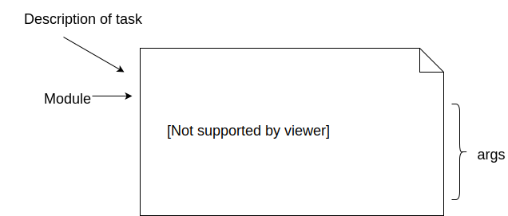

### Playbooks


#### Ansible Playbook

* Primary means of:
  * Configuration management
  * Deploying applications
  * Provisioning 
  * Orchestration
* A sequence of tasks


#### Ansible Playbooks

```
cd $WORKDIR/working-with-playbooks
```
```
.
├── ansible.cfg
├── hosts
├── static-site.yml
├── templates
│   ├── index.html.j2
│   └── mysite.conf.j2
└── Vagrantfile
```

| Name  | Type  | Description |
|--- | ---- |   ----- |
| `static-site.yml` | file  | Ansible playbook |
| files        | directory | Artefacts to be placed on remote host |
| templates    | directory | Templates that will be rendered and uploaded to remote host |


#### Ansible Playbook Structure
<div style="width:50%;float:left;">
    
</div>

<div style="width:50%;float:left;">
<ul>
<li class="fragment" data-fragment-index="0">
    A playbook is a YAML file containing a list of
    <em>plays</em>
</li>
<li class="fragment" data-fragment-index="1">
    A play is a dictionary object

    <ul><li>
            <code style="color:red;">key</code><code>: </code><code style="color:blue;">value</code>
        </li></ul>
</li>
<li class="fragment" data-fragment-index="2">
    Some keys in a play may contain dictionaries or
    lists
</li>
</ul>
</div>


#### Ansible Playbook Structure

                            
* A play must contain:
   * `hosts`
     * A string representing a particular host or _group_ of hosts
       * `hosts: localhost`
       * `hosts: app.mywebsite.com`
       * `hosts: appserver`
     * These are what you will configure


#### Ansible Playbook Structure

* A play may optionally contain:
   * tasks
     * A list of dictionaries
     * What you want to do
   * name
     * Description of the play
   * vars
     * Variables scoped to the play


#### Structure of a Task

* A task is a dictionary object containing
  * name 
    * Describes what the task does
    * Optional but best practice to use
  * module
    * Dictionary object
    * Key represents Python module which will perform tasks
    * May have arguments


#### Structure of a Task
<div style="width:50%;float:left;">
    
</div>
<div style="width:50%;float:left;">
    <ul>
        <li>
            Two styles of module object in tasks
            <ul>
                <li>string form</li>
                <li>dictionary form</li>
            </ul>
        </li>
        <li>
            Dictionary form is more suitable for complex arguments
        </li>
        <li>
            Matter of preference/style
        </li>
    </ul>
</div>


#### Create a new VM

```
vagrant up --provider virtualbox
```

* This creates an Ubuntu VM 
* Additional ports for a static website
  * 80 (HTTP)
  * 443 (HTTPS)


#### Deploy and configure an application


* `static-site.yml` performs following actions
   + Installs nginx package
   + Templates our nginx config (`templates/mysite.conf.j2`)
   + Renders template file (<code>templates/index.html.j2</code>) and place it on host
   + Re/Starts nginx


#### Run our first playbook

```
ansible-playbook static-site.yml
```

<asciinema-player start-at="10" autoplay="0"  loop="loop" font-size="medium" speed="1"
     theme="solarized-light" src="lib/basic-static-site.json" cols="200" rows="15"></asciinema-player>

Visit the <!-- .element: class="fragment" data-fragment-index="0" -->[static site](http://localhost:8080) once playbook has finished.


#### Privilege Escalation
* Some tasks we need to perform require sudo privileges on target machine
  <!-- .element: class="fragment" data-fragment-index="0" -->
* The <!-- .element: class="fragment" data-fragment-index="1" -->_become_ attribute tells Ansible to run tasks as a certain user
   + By default this is _sudo_
   + Specify user with `become_user`
   <pre style="font-size:18pt;"><code data-trim data-noescape>
    - name: Set up static website with nginx
       hosts: myserver
       <mark >become: true</mark>
       tasks:
   </code></pre>
* Can be in <!-- .element: class="fragment" data-fragment-index="2" -->_play_ or _task_ scope
* Accepts <!-- .element: class="fragment" data-fragment-index="3" --> _yes_ or _true_ (_no_ or _false_ are implicit)


#### Ansible Abstraction Layer
* We have used both <!-- .element: class="fragment" data-fragment-index="0" -->`yum` and `apt` to install packages in previous exercises, respectively
* Some automation tools abstract common functions from different operating systems <!-- .element: class="fragment" data-fragment-index="1" -->
   + Eg. <!-- .element: class="fragment" data-fragment-index="2" -->_package_ to abstract package managers from various OS
* Ansible has a <!-- .element: class="fragment" data-fragment-index="3" -->_thin_ abstraction layer 
   + On Debian/Ubuntu use <!-- .element: class="fragment" data-fragment-index="4" -->_apt_ module
   + On Centos use <!-- .element: class="fragment" data-fragment-index="5" -->_yum_ module 


####  Idempotent Behaviour
* It is sometimes necessary to run configuration/deploy tools more than once
   + Debugging
   + Temporary issues (eg. loss of network)
* Can be problematic if operations not prepared to manage repetition
   + Unmanaged duplication
   + Errors caused by violating unique constraints


#### Idempotent Behaviour
* Most Ansible modules aim to be <!-- .element: class="fragment" data-fragment-index="0" -->_idempotent_
* Can be run repeatedly and will only change <!-- .element: class="fragment" data-fragment-index="1" -->_once_
* Output of each task indicates when target action resulted in a change <!-- .element: class="fragment" data-fragment-index="1" -->
   + `ok` <!-- .element: style="color:green;"  -->: Already in desired state;
     Ansible did not change anything
   + `changed` <!-- .element: style="color:orange;"  -->: Ansible changed to
     desired state
*  Makes behaviour <!-- .element: class="fragment" data-fragment-index="2" -->_declarative_


##### Exercise: Idempotent Behaviour
* Log into your VM and remove some files
   ```
   vagrant ssh
   sudo rm -f /usr/share/nginx/html/index.html /etc/nginx/sites-available/mysite.conf
   ```
   <!-- .element: style="font-size:10pt;"  -->
* Run the `static-site-fail.yml` playbook 
* Remove _fail_ task and run again


#### Summary

* Use Ansible Playbook to run complex tasks
* Playbook consists of array of YAML dictionaries called <em>plays</em>
* Each play contains array of tasks that are executed on remote host
